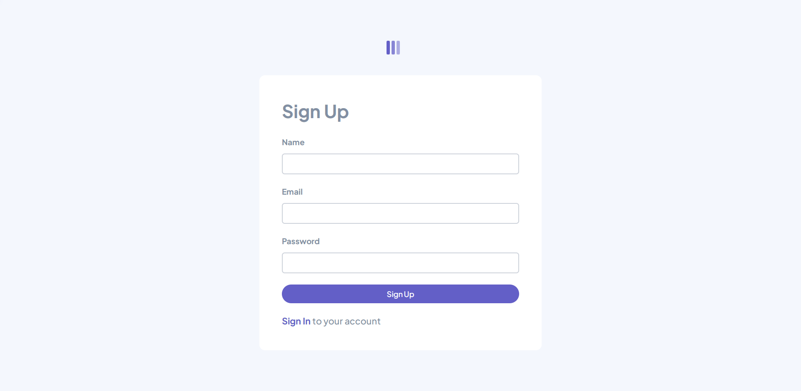
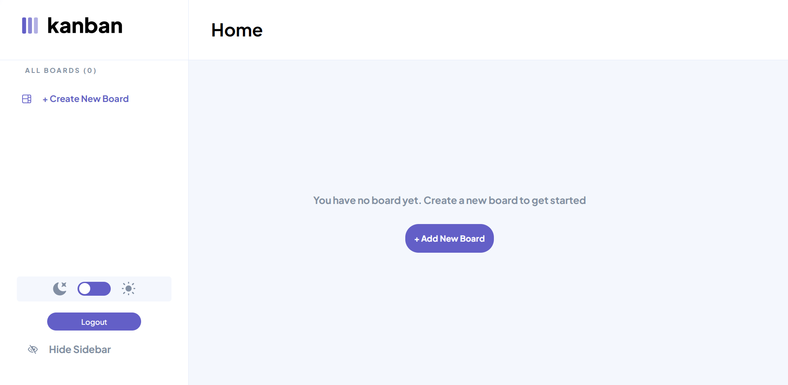
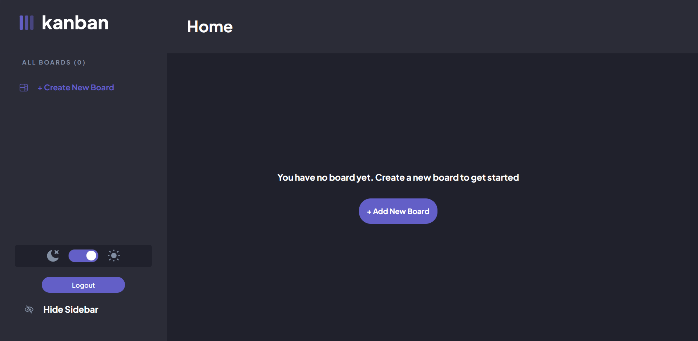
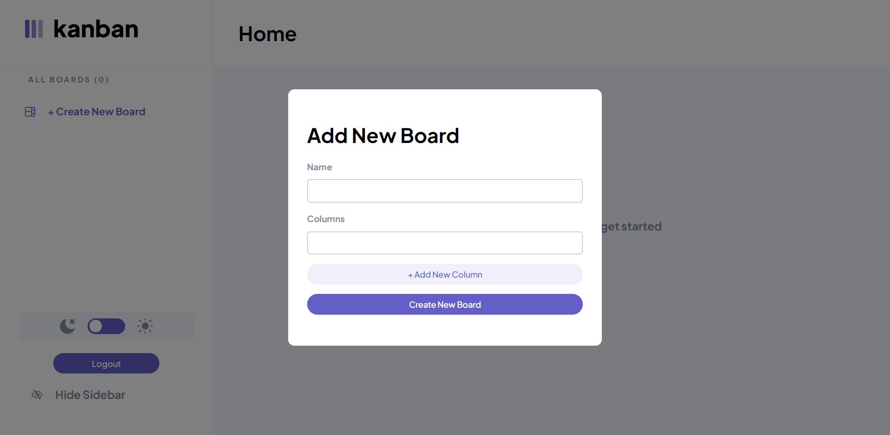
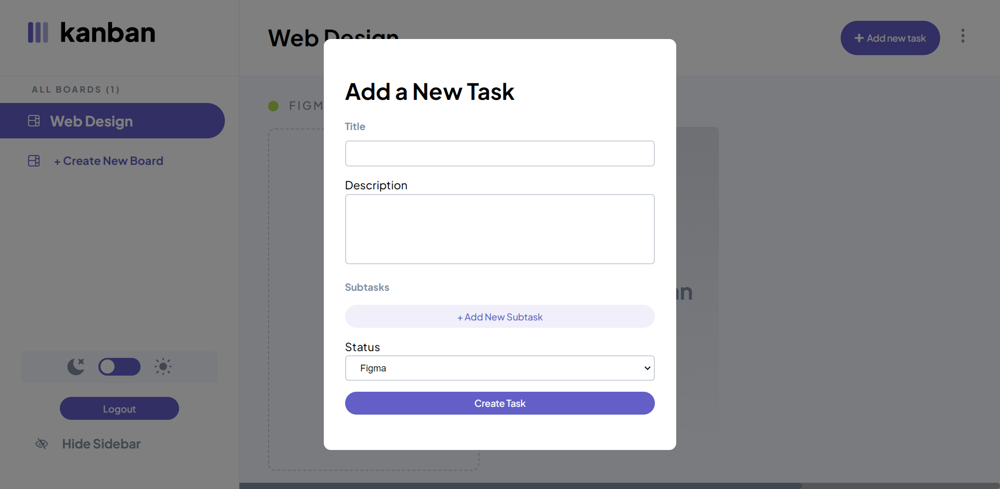
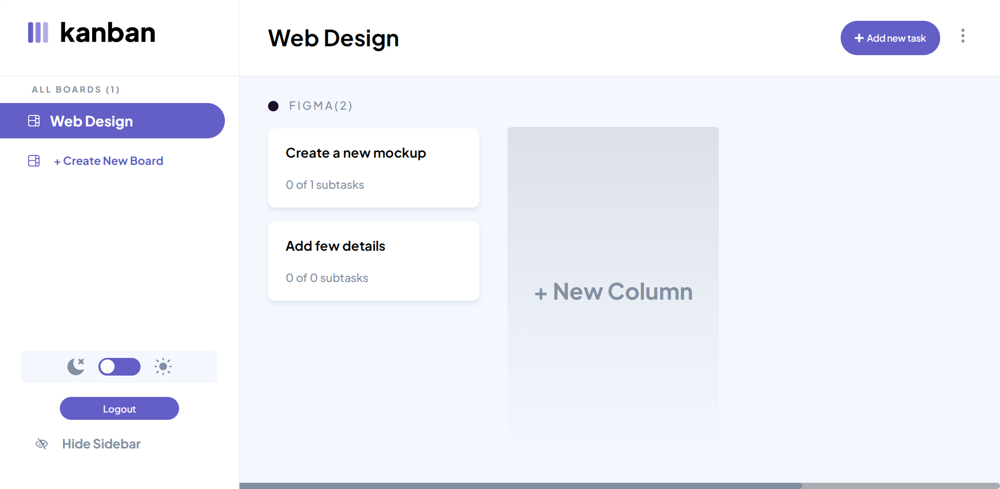
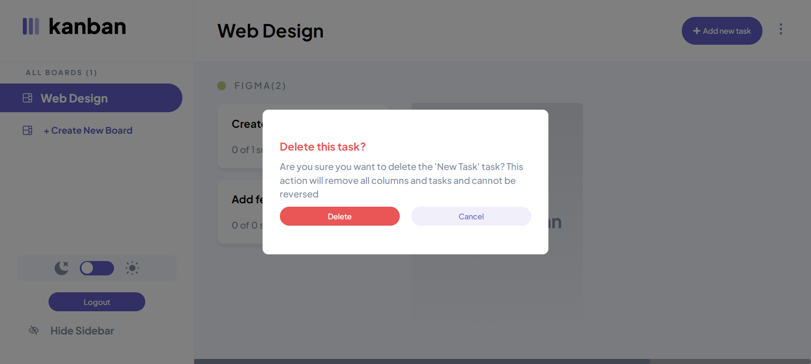

# A Full Stack Task Management App

## Screenshot

## An App that allows users to:

- Sign up and Login with their account
- Sign in with google
- View the optimal layout for the app depending on their device's screen size
- See hover states for all interactive elements on the page
- Create, read, update, and delete boards and tasks
- Receive form validations when trying to create/edit boards and tasks
- Mark subtasks as complete and move tasks between columns
- Hide/show the board sidebar
- Toggle the theme between light/dark modes

### App Behavior

Boards

- Clicking different boards in the sidebar will change to the selected board.
- Clicking "Create New Board" in the sidebar opens the "Add New Board" modal.
- Clicking in the dropdown menu "Edit Board" opens up the "Edit Board" modal where details can be changed.
- Columns are added and removed for the Add/Edit Board modals.
- Deleting a board deletes all columns and tasks and requires confirmation.

Columns

- A board needs at least one column before tasks can be added. If no columns exist, the "Add New Task" button in the header is disabled.
- Clicking "Add New Column" opens the "Edit Board" modal where columns are added.
Tasks
Adding a new task adds it to the bottom of the relevant column.

### Links

- Live Site URL: [Live](https://kanbanapp.onrender.com)

### Built with

- NodeJS
- ExpressJs
- MongoDB
- Semantic HTML5 markup
- SCSS
- Flexbox
- CSS Grid
- Mobile-first workflow
- Redux
- Redux toolkit
- axios
- [React](https://reactjs.org/) - JS library
- [Render](https://render.com) for deployment

## Author

- Website - [Jesufemi Oladapo](https://jesufemi.dev)
- Blog - [myBlog](https://blog.jesufemi.dev)
- Twitter - [@jesufemigan](https://www.twitter.com/jesufemigan)
